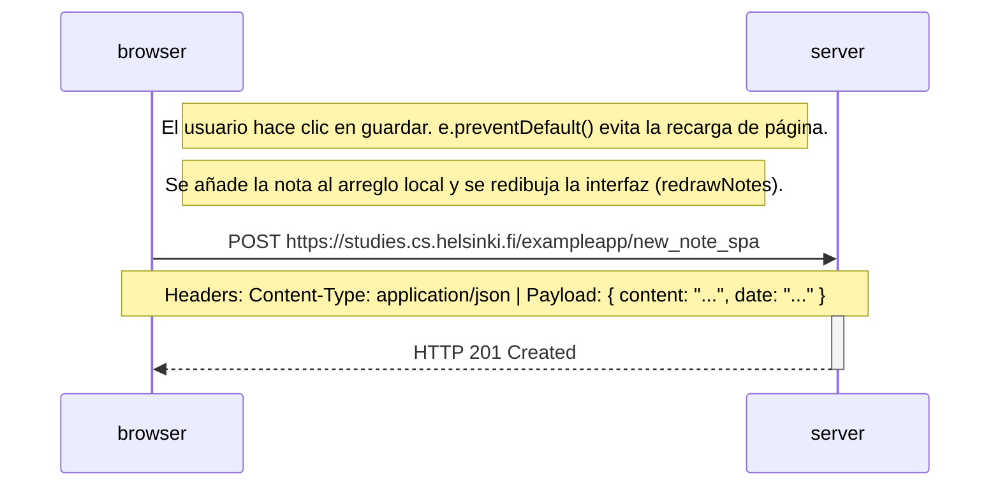

```mermaid
sequenceDiagram
    participant browser
    participant server

    Note right of browser: El usuario hace clic en guardar. e.preventDefault() evita la recarga de página.
    Note right of browser: Se añade la nota al arreglo local y se redibuja la interfaz (redrawNotes).

    browser->>server: POST https://studies.cs.helsinki.fi/exampleapp/new_note_spa
    Note over browser,server: Headers: Content-Type: application/json | Payload: { content: "...", date: "..." }
    activate server
    server-->>browser: HTTP 201 Created
    deactivate server
```